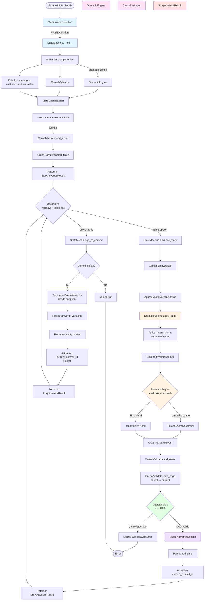
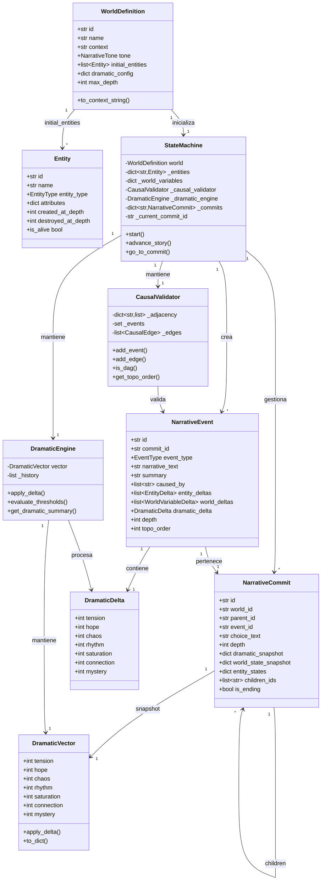
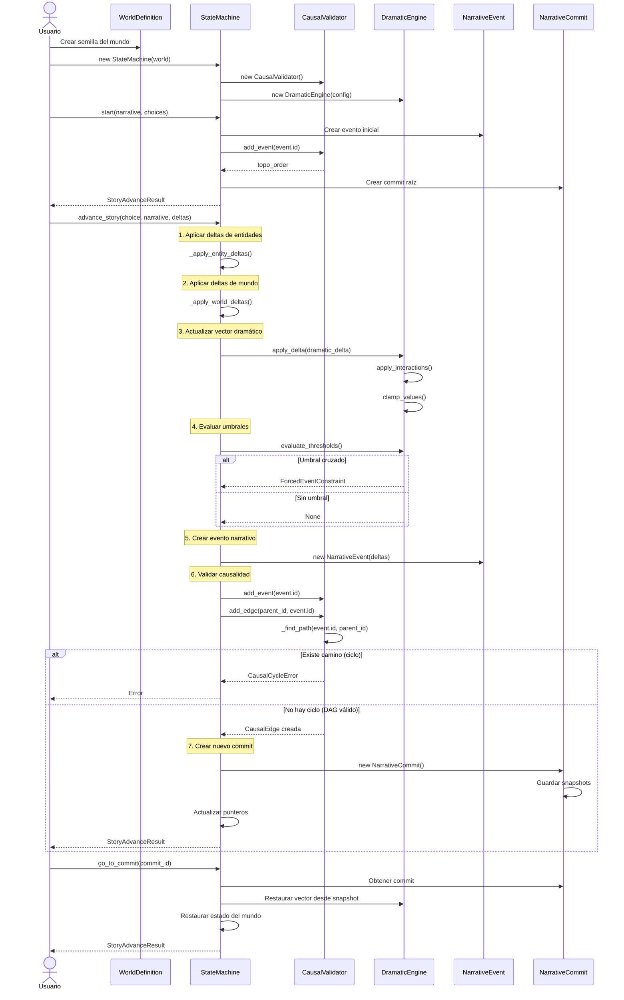
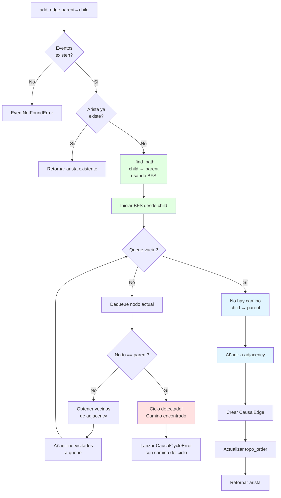
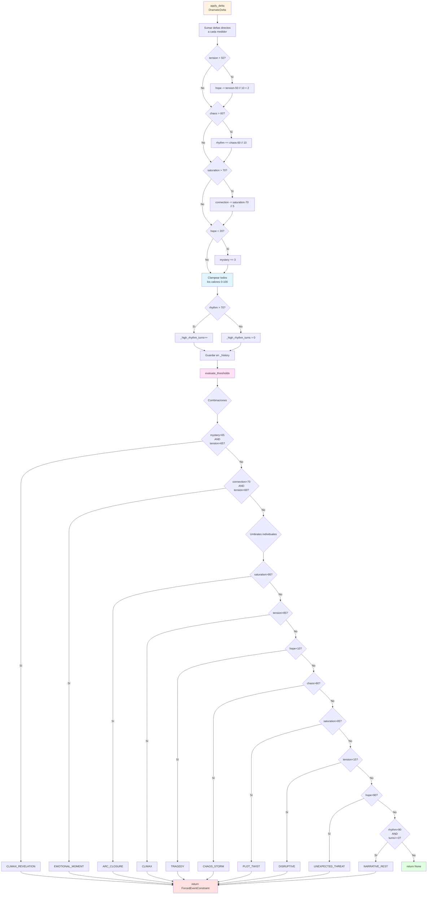

# Diagrama de Flujo - Causal Narrative Engine

## Flujo Principal del Motor

## Modelos Principales y sus Relaciones

## Secuencia de Ejecución Completa

## Flujo de Validación Causal (Detección de Ciclos)

## Flujo de Evaluación Dramática (Sistema SDMM)

## Resumen de Componentes por Fase

| Componente | Responsabilidad | Modelos que usa | Modelos que produce |
|------------|----------------|-----------------|---------------------|
| **WorldDefinition** | Semilla inmutable del universo narrativo | Entity, dramatic_config | - |
| **StateMachine** | Orquestador central | WorldDefinition, Entity, NarrativeEvent, NarrativeCommit | StoryAdvanceResult |
| **CausalValidator** | Garantizar DAG sin ciclos | NarrativeEvent.id, CausalEdge | topo_order, estadísticas DAG |
| **DramaticEngine** | Gestionar vector dramático y umbrales | DramaticDelta, DramaticVector | ForcedEventConstraint (o None) |
| **NarrativeEvent** | Unidad atómica de la historia | EntityDelta, WorldVariableDelta, DramaticDelta | - |
| **NarrativeCommit** | Punto versionado (como Git) | NarrativeEvent, snapshots del estado | - |
| **StoryAdvanceResult** | Respuesta del motor al cliente | NarrativeCommit, DramaticVector, NarrativeChoice | - |

---

**Propiedad Invariante Clave**: El grafo de eventos es SIEMPRE un DAG. Esto garantiza:
- ✅ Reconstrucción determinista del estado
- ✅ Sin paradojas causales (A causa A)
- ✅ Orden topológico válido
- ✅ Navegación hacia atrás coherente
