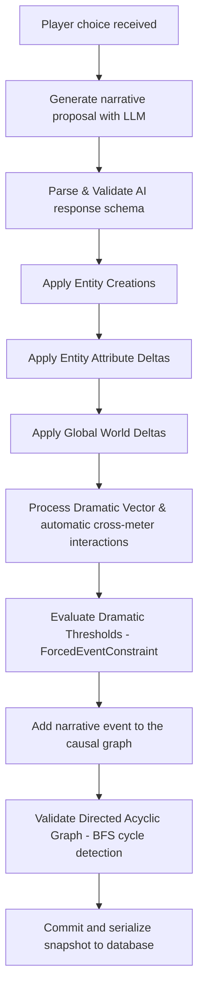

# CNE Narrative Flow Diagram

The Causal Narrative Engine (CNE) enforces formal narrative state transitions. Below is the comprehensive step-by-step sequence of how the engine advances the story and validates causal relationships.

## State Transition Sequence

## Step-by-Step Detail

### 1. Proposal Generation
The AI receives the active context trunk (comprising immutable world definitions, recent detailed chapters, and compressed history), the current state of world variables, and the player's choice. It produces a structured JSON proposal containing:
- Narrative text
- Causal summary
- Choice options with previews
- Dynamic entity creations
- State deltas

### 2. Entity Creation
Before any state deltas are processed, new characters, locations, or items are instantiated and registered. This ensures that subsequent deltas in the same turn can safely reference these entities.

### 3. State Mutation
Attribute deltas and global world variables are updated in the in-memory StateMachine state.

### 4. Dramatic Engine & Pacing
Meters are updated with direct deltas. Then, the system runs automated interactions:
- High tension erodes hope.
- High chaos speeds up narrative rhythm.
- Extreme saturation erodes connection.
Thresholds are evaluated. If a critical meter is reached, a forced event constraint (e.g., CLIMAX, TRAGEDY, PLOT_TWIST) is generated for the next turn.

### 5. Causal DAG Validation
A new narrative event and its causal edges are added to the causal history graph. The causal validator performs BFS-based cycle detection. If any circular reference is detected, a `CausalCycleError` is thrown, rejecting the transition.

### 6. Persistence & Serialization
The final state is committed as a new repository commit, saving ORM entities, events, choices, and snapshot state to PostgreSQL.
